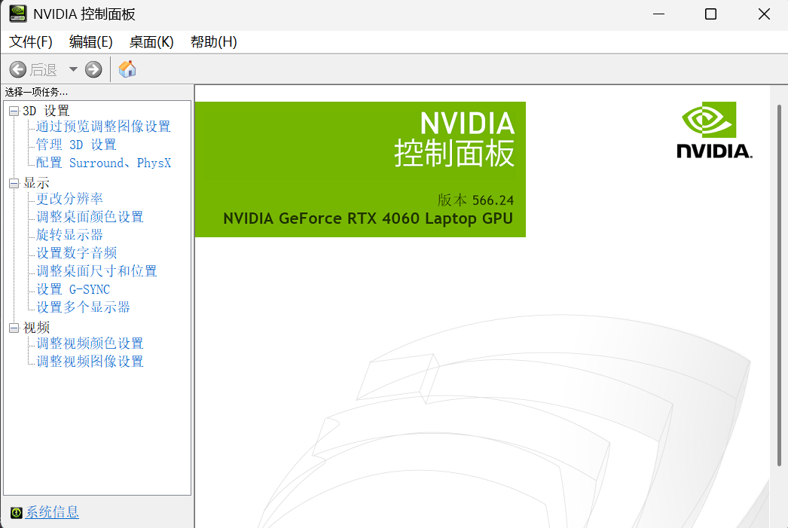
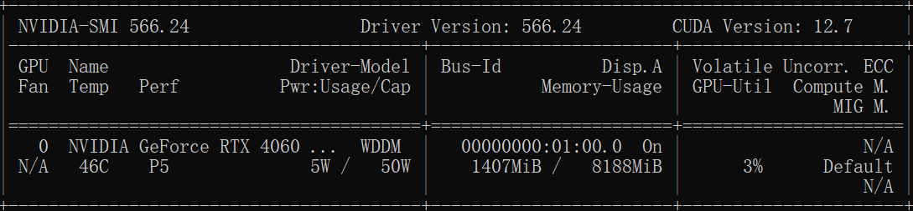
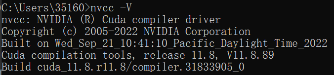
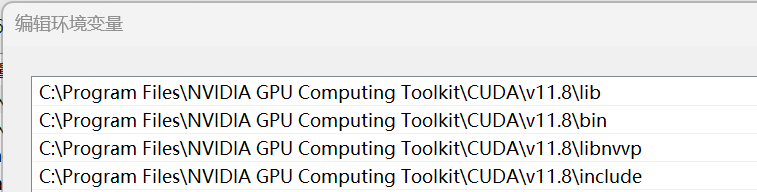
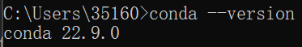
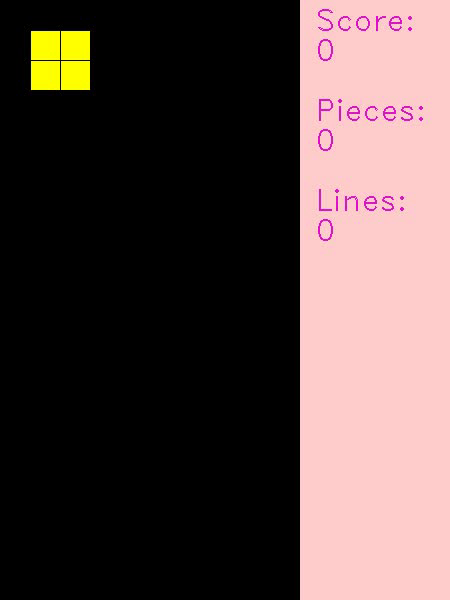
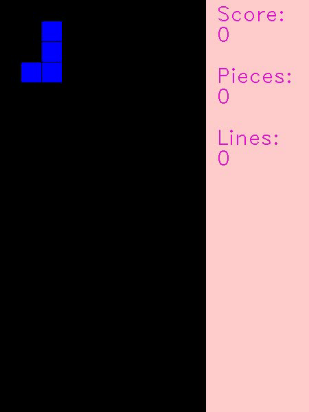
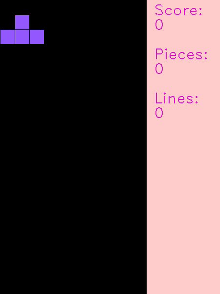

# Lunar Lander Based on DQN

## 项目名称

Tetris_Based_on_DQN

## 项目简介

Reinforcement Learning Lab: Lunar Lander Based on Deep Q-Network.

强化学习实验：基于 Deep Q-Network 的俄罗斯方块


## 项目组成

* `/figures`
存放 `README.md` 文件所需的相关图片资源

* `/models`
模型文件

* `/src`
代码文件

  * `deep_q_network.py`
  `DeepQNetwork` 类

  * `tetris.py`
  `Tetris` 类

* `Report.pptx`
实验报告 PPT

* `test.py`
模型测试脚本

* `train.py`
模型训练脚本

## 环境搭建

1. 安装 [NVIDIA GeForce 驱动程序](https://www.nvidia.cn/geforce/drivers)，并检查 GeForce Game Ready 为最新版本

   

2. 在命令提示符输入 `nvidia-smi` 查看驱动版本和 CUDA 版本

   

3. 安装对应版本的 [CUDA Toolkit](https://developer.nvidia.com/cuda-downloads)，并在命令提示符输入 `nvcc -V` 查看版本信息

   

4. 安装对应版本的 [cuDNN](https://developer.nvidia.com/cudnn-downloads)，将解压后的内容（ `bin`、`include`、`lib` 文件夹 ）移动到 CUDA Toolkit 的安装路径中（默认安装路径为 `C:\Program Files\NVIDIA GPU Computing Toolkit\CUDA\v12.4` ），打开 `include` 文件夹中的 `cudnn_version.h` 查看版本信息

   ```c
   #define CUDNN_MAJOR 9
   #define CUDNN_MINOR 1
   #define CUDNN_PATCHLEVEL 1
   ```

5. 将 CUDA Toolkit 安装路径中的 `bin`、`include`、`lib`、`libnvvp` 文件夹添加至系统环境变量（默认安装路径为 `C:\Program Files\NVIDIA GPU Computing Toolkit\CUDA\v12.4` ）

   

6. 安装 [Anaconda](https://www.anaconda.com)，设置 Anaconda 环境变量，并在命令提示符输入 `conda --version` 查看版本信息

   

7. 创建 conda 环境，Python 版本 3.9

   ```bash
   conda create -n dqn python=3.9
   ```

8. 激活 conda 环境

   ```bash
   conda activate dqn
   ```

9. 验证 GPU 可用性，查询当前系统中可用的 NVIDIA GPU 设备

    ```python
    import torch
    torch.cuda.is_available()
    torch.cuda.device_count()
    torch.cuda.current_device()
    torch.cuda.get_device_name(0)
    ```

    

10.  安装对应版本的 [PyTorch](https://pytorch.org/get-started/locally)

    ```bash
    pip install torch==2.2.1 torchvision==0.17.1 torchaudio==2.2.1 --index-url https://download.pytorch.org/whl/cu118
    ```


11. 安装 其他依赖包

    ```bash
    pip install tensorboard tensorboardX
    pip install opencv-python
    pip install matplotlib
    pip install imageio
    ```

## 项目运行

* 训练模型

  ```bash
  python train.py
  ```

* 测试模型

  ```bash
  python test.py
  ```

* 查看训练数据

  ```bash
  tensorboard --logdir=tensorboard
  ```

## 不同迭代次数表现

<p align="center">





  <br>200 / 400 / 600 / 800 / 1000 Iterations<br>


  <br>1200 / 1400 / 1600 / 1800 / 2000 Iterations<br>
</p>

Algorithm 1: Deep Q-Learning with Experience Replay

Initialize memory buffer $D$ with capacity $N$
Initialize $Q$-Network with random weights $w$

for episode = 1 to $M$ do
    Receive initial observation state $s_1$ from environment
    Initialize replay memory $D$ as an empty deque with maximum length $N$
    Set initial state $s_t = s_1$
    
    while not done do
        With probability $\varepsilon$ select a random action $a_t$, otherwise select $a_t = \arg\max_a Q(s_t, a)$
        Execute action $a_t$ in the environment, receive reward $r_t$ and next state $s_{t+1}$
        Store transition tuple $(s_t, a_t, r_t, s_{t+1}, done)$ in replay memory $D$
        
        If length of $D$ is less than $N/10$, skip training
        Otherwise:
            Sample a random mini-batch of transitions $(s_j, a_j, r_j, s_{j+1}, done_j)$ from $D$
            Compute target value:
                $y_j = r_j$ if $done_j$ is True
                $y_j = r_j + \gamma \max_{a'} Q(s_{j+1}, a')$ otherwise
            Perform a gradient descent step on $(y_j - Q(s_j, a_j))^2$ w.r.t weights $w$
            Update $Q$-Network weights $w$ using Adam optimizer
        
        Update state $s_t = s_{t+1}$
    end
    
    If episode is a multiple of save_interval, save the $Q$-Network model
end

Save final $Q$-Network model