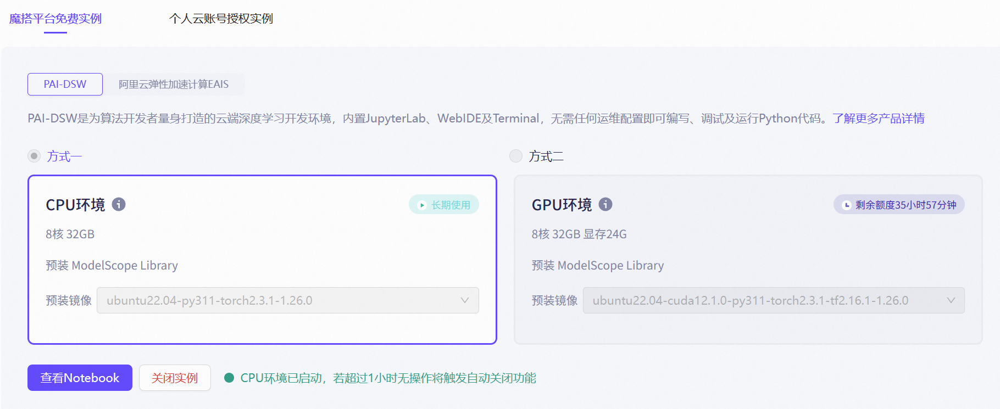
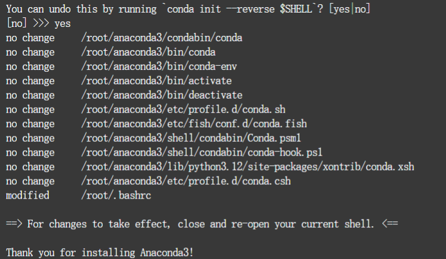
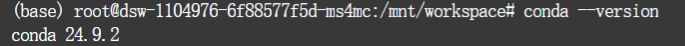
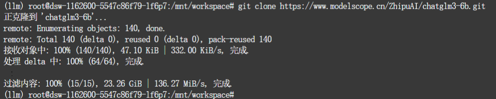
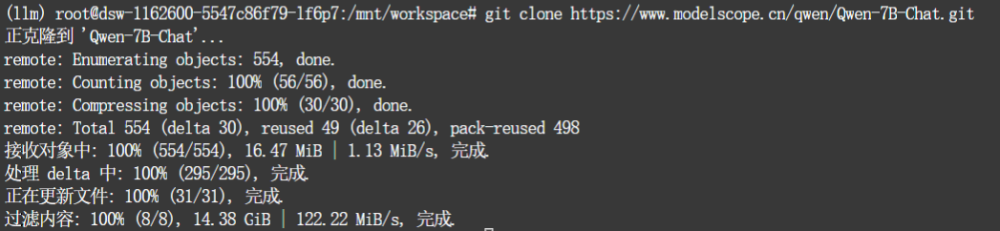
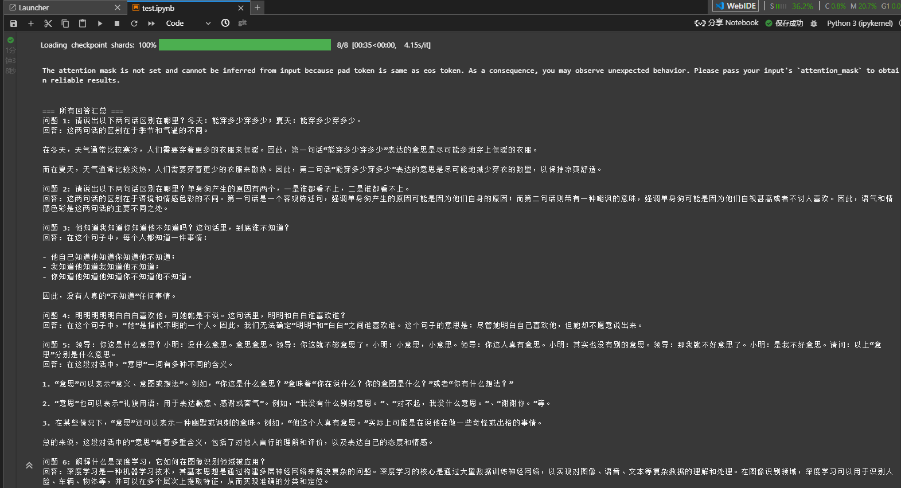
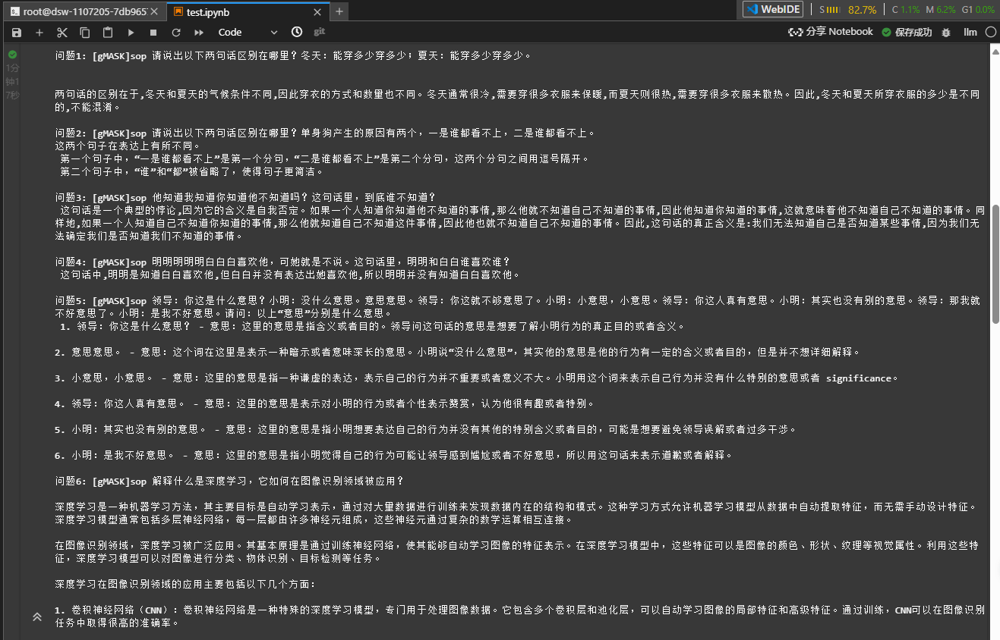

# LLM Deployment

## 项目名称

LLM_Deployment

## 项目简介

Large language model deployment.

大语言模型部署。

## 环境搭建

* 在[魔搭社区](https://www.modelscope.cn)启动 PAI-DSW CPU 环境

  

* 打开终端并运行以下命令

  ```bash
  curl -O https://repo.anaconda.com/archive/Anaconda3-2024.10-1-Linux-x86_64.sh
  ```

* 安装 Anaconda Distribution

  ```bash
  bash Anaconda3-2024.10-1-Linux-x86_64.sh
  ```

* 按回车键查看 Anaconda 的服务条款 （TOS）。 然后按住 Return 键滚动，输入 `yes` 以同意 TOS



* 使用以下命令刷新终端

  ```bash
  source ~/.bashrc
  ```

* 输入以下命令，查看 Anaconda 版本

  ```bash
  conda --version
  ```



* 创建并激活虚拟环境

  ```bash
  conda create -n llm python=3.10 -y
  conda activate llm
  ```

* 替换方法（若无法通过anaconda创建虚拟环境）
  
* 打开终端

  ```bash
  python -m virtualenv llm
  ```

* 激活虚拟环境

  ```bash
  source llm/bin/activate
  ```

* 安装ipykernel

  ```bash
  pip install ipykernel
  ```

* 将内核添加到用户界面

  ```bash
  python -m ipykernel install --user --name=llm --display-name="llm"
  ```

* 安装依赖

  ```bash
  pip install \
    torch==2.3.0+cpu \
    torchvision==0.18.0+cpu \
    --index-url https://download.pytorch.org/whl/cpu
  pip install \
    "intel-extension-for-transformers==1.4.2" \
    "neural-compressor==2.5" \
    "transformers==4.33.3" \
    "modelscope==1.9.5" \
    "pydantic==1.10.13" \
    "sentencepiece" \
    "tiktoken" \
    "einops" \
    "transformers_stream_generator" \
    "uvicorn" \
    "fastapi" \
    "yacs" \
    "setuptools_scm" \
    "accelerate" 
  pip install fschat --use-pep517
  pip install tqdm huggingface_hub
  ```

## LLM 下载

* 切换至工作目录

  ```bash
  cd /mnt/workspace
  ```

* 根据实验需要，下载相对应的中文大模型至本地

  ```bash
  git clone https://www.modelscope.cn/qwen/Qwen-7B-Chat.git
  git clone https://www.modelscope.cn/ZhipuAI/chatglm3-6b.git
  ```

  
  
  

* Qwen-7B-Chat 目录结构

  ```bash
  QWen-7B-Chat/
  ├── assets/
  ├── examples/
  ├── cache_autogptq_cuda_256.cpp
  ├── cache_autogptq_cuda_kernel_256.cu
  ├── config.json
  ├── configuration_qwen.py
  ├── configuration.jsonh
  ├── cpp-kernels.py
  ├── generation_config.json
  ├── LICENSE
  ├── model-00001-of-00008.safetensors
  ├── model-00002-of-00008.safetensors
  ├── model-00003-of-00008.safetensors
  ├── model-00004-of-00008.safetensors
  ├── model-00005-of-00008.safetensors
  ├── model-00006-of-00008.safetensors
  ├── model-00007-of-00008.safetensors
  ├── model-00008-of-00008.safetensors
  ├── model.safetensors.index.json
  ├── modeling_qwen.py
  ├── NOTICE
  ├── qwen_generation_utils.py
  ├── qwen.tiktoken/
  ├── README.md
  ├── tokenization_qwen.py
  ├── tokenizer_config.json
  ```

## 部署大语言模型[通义千问 Qwen-7B-Chat](https://www.modelscope.cn/models/qwen/Qwen-7B-Chat/summary)

* 加载模型

```python
from modelscope import AutoModelForCausalLM, AutoTokenizer
from modelscope import GenerationConfig

model_name = "/mnt/data/Qwen-7B-Chat"

# 加载 tokenizer 和模型
tokenizer = AutoTokenizer.from_pretrained(model_name, trust_remote_code=True)
model = AutoModelForCausalLM.from_pretrained(model_name, device_map="auto", trust_remote_code=True).eval()

# 存储所有回答
all_outputs = []
```

* 推理

```python

# 提问列表
prompts = [
    "请说出以下两句话区别在哪里？冬天：能穿多少穿多少；夏天：能穿多少穿多少。",
    "请说出以下两句话区别在哪里？单身狗产生的原因有两个，一是谁都看不上，二是谁都看不上。",
    "他知道我知道你知道他不知道吗？这句话里，到底谁不知道？",
    "明明明明明白白白喜欢他，可她就是不说。这句话里，明明和白白谁喜欢谁？",
    "领导：你这是什么意思？小明：没什么意思。意思意思。领导：你这就不够意思了。小明：小意思，小意思。领导：你这人真有意思。小明：其实也没有别的意思。领导：那我就不好意思了。小明：是我不好意思。请问：以上“意思”分别是什么意思。",
    "解释什么是深度学习，它如何在图像识别领域被应用？",
    "请使用逻辑推理解释为什么“这句话是假的”是一个悖论。",
    "请解释贝叶斯定理，并给出一个生活中的应用例子。",
    "为什么大多数卫星都是向东发射？请从物理学角度解释。",
    "编写一个简单的计算机程序，模拟掷骰子的结果。"
]

# 遍历每个提示并生成回答
for i, prompt in enumerate(prompts, 1):
    response, _ = model.chat(tokenizer, prompt, history=None)
    all_outputs.append(f"问题 {i}: {prompt}\n回答: {response}\n")

# 打印所有回答汇总 
print("\n=== 所有回答汇总 ===")
for output in all_outputs:
    print(output)
```

* 通义千问 Qwen-7B-Chat 输出结果

  ```
  问题 1: 请说出以下两句话区别在哪里？冬天：能穿多少穿多少；夏天：能穿多少穿多少。
  回答: 这两句话的区别在于季节和气温的不同。

  在冬天，天气通常比较寒冷，人们需要穿着更多的衣服来保暖。因此，第一句话“能穿多少穿多少”表达的意思是尽可能多地穿上保暖的衣服。

  而在夏天，天气通常比较炎热，人们需要穿着更少的衣服来散热。因此，第二句话“能穿多少穿多少”表达的意思是尽可能地减少穿衣的数量，以保持凉爽舒适。

  问题 2: 请说出以下两句话区别在哪里？单身狗产生的原因有两个，一是谁都看不上，二是谁都看不上。
  回答: 这两句话的区别在于语境和情感色彩的不同。第一句话是一个客观陈述句，强调单身狗产生的原因可能是因为他们自身的原因；而第二句话则带有一种嘲讽的意味，强调单身狗可能是因为他们自视甚高或者不讨人喜欢。因此，语气和情感色彩是这两句话的主要不同之处。

  问题 3: 他知道我知道你知道他不知道吗？这句话里，到底谁不知道？
  回答: 在这个句子中，每个人都知道一件事情：

  - 他自己知道他知道你知道他不知道；
  - 我知道他知道我知道他不知道；
  - 你知道他知道他知道你不知道他不知道。

  因此，没有人真的“不知道”任何事情。

  问题 4: 明明明明明白白白喜欢他，可她就是不说。这句话里，明明和白白谁喜欢谁？
  回答: 在这个句子中，“她”是指代不明的一个人。因此，我们无法确定“明明”和“白白”之间谁喜欢谁。这个句子的意思是：尽管她明白自己喜欢他，但她却不愿意说出来。

  问题 5: 领导：你这是什么意思？小明：没什么意思。意思意思。领导：你这就不够意思了。小明：小意思，小意思。领导：你这人真有意思。小明：其实也没有别的意思。领导：那我就不好意思了。小明：是我不好意思。请问：以上“意思”分别是什么意思。
  回答: 在这段对话中，“意思”一词有多种不同的含义。

  1. “意思”可以表示“意义、意图或想法”。例如，“你这是什么意思？”意味着“你在说什么？你的意图是什么？”或者“你有什么想法？”

  2. “意思”也可以表示“礼貌用语，用于表达歉意、感谢或客气”。例如，“我没有什么别的意思。”、“对不起，我没什么意思。”、“谢谢你。”等。

  3. 在某些情况下，“意思”还可以表示一种幽默或讽刺的意味。例如，“他这个人真有意思。”实际上可能是在说他在做一些奇怪或出格的事情。

  总的来说，这段对话中的“意思”有着多重含义，包括了对他人言行的理解和评价，以及表达自己的态度和情感。

  问题 6: 解释什么是深度学习，它如何在图像识别领域被应用？
  回答: 深度学习是一种机器学习技术，其基本思想是通过构建多层神经网络来解决复杂的问题。深度学习的核心是通过大量数据训练神经网络，以实现对图像、语音、文本等复杂数据的理解和处理。在图像识别领域，深度学习可以用于识别人脸、车辆、物体等，并可以在多个层次上提取特征，从而实现准确的分类和定位。

  问题 7: 请使用逻辑推理解释为什么“这句话是假的”是一个悖论。
  回答: "这句话是假的"这个陈述本身就是一个悖论，因为如果它是真的，那么它就是假的；如果它是假的，那么它又是真的。

  这是一个典型的自指性悖论，也被称为卢卡斯悖论或罗素悖论。这种类型的悖论是基于一些定义或者规则的内在矛盾。

  在这个悖论中，我们有两个可能的情况：

  1. "这句话是假的"是真的。
  2. "这句话是假的"是假的。

  如果第一个情况是真的，那么根据我们的陈述，这个陈述是假的。所以第二个情况也是真的。

  但是，如果我们接受第二个情况，即"这句话是假的"是假的，那么根据我们的陈述，这个陈述是真的。因此，第一个情况也是正确的。

  这就是为什么"这句话是假的"是一个悖论。无论我们选择哪种情况，都会导致自相矛盾的结果。

  问题 8: 请解释贝叶斯定理，并给出一个生活中的应用例子。
  回答: 贝叶斯定理是统计学中一种重要的概率理论，它描述了在给定某些证据的情况下，另一个事件发生的概率如何变化。简而言之，它是通过已知的先验知识和新的观察数据来更新我们对某个事件的概率信念的方法。

  具体来说，如果A和B之间存在因果关系，那么我们可以通过收集有关B的信息来更好地理解A的可能性。贝叶斯定理提供了一种计算这个可能性的方法，即先验概率P(A)乘以似然概率P(B|A)，然后除以后验概率P(B)，从而得到P(A|B)。

  例如，在医学诊断中，我们可以将症状作为证据（B），并将患者的疾病（A）看作是一个可能的结果。如果我们知道一个人有某种疾病的发病率（先验概率），并且他们出现了这种疾病的常见症状（似然概率），我们就可以使用贝叶斯定理来估计他们患病的概率（后验概率）。这样可以帮助医生做出更准确的诊断，或者帮助患者了解他们的风险程度。

  问题 9: 为什么大多数卫星都是向东发射？请从物理学角度解释。
  回答: 地球的自转方向是从西向东，所以在发射卫星时，如果卫星朝着东边发射，就可以利用地球的自转来节省燃料和时间成本，从而实现更快、更远的目标轨道。因此，大多数卫星都是向东发射的。

  问题 10: 编写一个简单的计算机程序，模拟掷骰子的结果。
  回答: 这是一个简单的Python程序，它模拟掷骰子的结果：

  ```python
  import random

  def roll_dice():
      return random.randint(1, 6)

  print("Rolling dice...")
  dice_roll = roll_dice()
  print(f"The dice rolled {dice_roll}")
  ```

  在这个程序中，我们首先导入了random模块，该模块包含了一些用于生成随机数的函数。然后，我们定义了一个名为roll_dice()的函数，这个函数会返回一个在1到6之间的随机整数。

  最后，我们调用roll_dice()函数来掷一次骰子，并打印出结果。每次运行程序时，都会得到一个新的、随机的骰子结果。
  ```



## 部署大语言模型[智谱 ChatGLM3-6B](https://www.modelscope.cn/models/ZhipuAI/chatglm3-6b/summary)

* 加载模型

```python
from transformers import AutoTokenizer, AutoModelForCausalLM
import torch

model_path = "/mnt/data/chatglm3-6b" 
tokenizer = AutoTokenizer.from_pretrained(model_path, trust_remote_code=True)
model = AutoModelForCausalLM.from_pretrained(model_path, device_map="auto", torch_dtype=torch.float16, trust_remote_code=True)

model.eval()
```

* 推理

```python
prompts = [
    "请说出以下两句话区别在哪里？冬天：能穿多少穿多少；夏天：能穿多少穿多少。",
    "请说出以下两句话区别在哪里？单身狗产生的原因有两个，一是谁都看不上，二是谁都看不上。",
    "他知道我知道你知道他不知道吗？这句话里，到底谁不知道？",
    "明明明明明白白白喜欢他，可她就是不说。这句话里，明明和白白谁喜欢谁？",
    "领导：你这是什么意思？小明：没什么意思。意思意思。领导：你这就不够意思了。小明：小意思，小意思。领导：你这人真有意思。小明：其实也没有别的意思。领导：那我就不好意思了。小明：是我不好意思。请问：以上“意思”分别是什么意思。",
    "解释什么是深度学习，它如何在图像识别领域被应用？",
    "请使用逻辑推理解释为什么“这句话是假的”是一个悖论。",
    "请解释贝叶斯定理，并给出一个生活中的应用例子。",
    "为什么大多数卫星都是向东发射？请从物理学角度解释。",
    "编写一个简单的计算机程序，模拟掷骰子的结果。"
]

for i, prompt in enumerate(prompts, 1):
    
    inputs = tokenizer(prompt, return_tensors="pt").to("cuda")

    with torch.no_grad():
        outputs = model.generate(
            inputs.input_ids,
            max_length=512,
            do_sample=True,
            top_p=0.9,
            temperature=0.7
        )

    response = tokenizer.decode(outputs[0], skip_special_tokens=True)
    print(f"问题{i}:", response,end="\n\n")
```

* 智谱 ChatGLM3-6B 输出结果

  ```
  问题1: [gMASK]sop 请说出以下两句话区别在哪里？冬天：能穿多少穿多少；夏天：能穿多少穿多少。

  两句话的区别在于,冬天和夏天的气候条件不同,因此穿衣的方式和数量也不同。冬天通常很冷,需要穿很多衣服来保暖,而夏天则很热,需要穿很多衣服来散热。因此,冬天和夏天所穿衣服的多少是不同的,不能混淆。

  问题2: [gMASK]sop 请说出以下两句话区别在哪里？单身狗产生的原因有两个，一是谁都看不上，二是谁都看不上。 
  这两个句子在表达上有所不同。
  第一个句子中，“一是谁都看不上”是第一个分句，“二是谁都看不上”是第二个分句，这两个分句之间用逗号隔开。
  第二个句子中，“谁”和“都”被省略了，使得句子更简洁。

  问题3: [gMASK]sop 他知道我知道你知道他不知道吗？这句话里，到底谁不知道？ 
  这句话是一个典型的悖论,因为它的含义是自我否定。如果一个人知道你知道他不知道的事情,那么他就不知道自己不知道的事情,因此他知道你知道的事情,这就意味着他不知道自己不知道的事情。同样地,如果一个人知道自己不知道你知道的事情,那么他就知道自己不知道这件事情,因此他也就不知道自己不知道的事情。因此,这句话的真正含义是:我们无法知道自己是否知道某些事情,因为我们无法确定我们是否知道我们不知道的事情。

  问题4: [gMASK]sop 明明明明明白白白喜欢他，可她就是不说。这句话里，明明和白白谁喜欢谁？ 
  这句话中,明明是知道白白喜欢他,但白白并没有表达出她喜欢他,所以明明并没有知道白白喜欢他。

  问题5: [gMASK]sop 领导：你这是什么意思？小明：没什么意思。意思意思。领导：你这就不够意思了。小明：小意思，小意思。领导：你这人真有意思。小明：其实也没有别的意思。领导：那我就不好意思了。小明：是我不好意思。请问：以上“意思”分别是什么意思。 
  1. 领导：你这是什么意思？ - 意思：这里的意思是指含义或者目的。领导问这句话的意思是想要了解小明行为的真正目的或者含义。

  2. 意思意思。 - 意思：这个词在这里是表示一种暗示或者意味深长的意思。小明说“没什么意思”，其实他的意思是他的行为有一定的含义或者目的，但是并不想详细解释。

  3. 小意思，小意思。 - 意思：这里的意思是指一种谦虚的表达，表示自己的行为并不重要或者意义不大。小明用这个词来表示自己行为并没有什么特别的意思或者 significance。

  4. 领导：你这人真有意思。 - 意思：这里的意思是表示对小明的行为或者个性表示赞赏，认为他很有趣或者特别。

  5. 小明：其实也没有别的意思。 - 意思：这里的意思是指小明想要表达自己的行为并没有其他的特别含义或者目的，可能是想要避免领导误解或者过多干涉。

  6. 小明：是我不好意思。 - 意思：这里的意思是指小明觉得自己的行为可能让领导感到尴尬或者不好意思，所以用这句话来表示道歉或者解释。

  问题6: [gMASK]sop 解释什么是深度学习，它如何在图像识别领域被应用？

  深度学习是一种机器学习方法，其主要目标是自动学习表示，通过对大量数据进行训练来发现数据内在的结构和模式。这种学习方式允许机器学习模型从数据中自动提取特征，而无需手动设计特征。深度学习模型通常包括多层神经网络，每一层都由许多神经元组成，这些神经元通过复杂的数学运算相互连接。

  在图像识别领域，深度学习被广泛应用。其基本原理是通过训练神经网络，使其能够自动学习图像的特征表示。在深度学习模型中，这些特征可以是图像的颜色、形状、纹理等视觉属性。利用这些特征，深度学习模型可以对图像进行分类、物体识别、目标检测等任务。

  深度学习在图像识别领域的应用主要包括以下几个方面：

  1. 卷积神经网络（CNN）：卷积神经网络是一种特殊的深度学习模型，专门用于处理图像数据。它包含多个卷积层和池化层，可以自动学习图像的局部特征和高级特征。通过训练，CNN可以在图像识别任务中取得很高的准确率。

  2. 物体识别：利用深度学习模型进行物体识别是计算机视觉领域的一个重要应用。通过训练神经网络，可以识别图像中的各种物体，例如人脸、车辆、动物等。

  3. 目标检测：目标检测是指在图像中检测出特定目标的位置和范围。深度学习模型可以自动学习目标的特点和形状，从而在图像中准确检测出目标。

  4. 图像分割：图像分割是指将图像划分成若干个互不重叠的区域，每个区域

  问题7: [gMASK]sop 请使用逻辑推理解释为什么“这句话是假的”是一个悖论。 
  假设“这句话是假的”是一个陈述，我们可以用逻辑推理来验证它是否是一个悖论。

  1. 假设“这句话是假的”，即：存在一个情况使得“这句话不是真的”。
  2. 由于假设成立，我们得到了一个结论：存在一个情况使得“这句话是假的”。
  3. 然而，根据我们的初始假设，这句话应该是真的，因为它表示“这句话是假的”。
  4. 所以，我们在第一步得到的结论与第二步得到的结论相矛盾。
  5. 这就导致了矛盾，因为我们的初始假设和我们的推理结果相互冲突。
  6. 因此，“这句话是假的”是一个悖论，因为它在尝试证明自己的真实性的同时又在逻辑上自我矛盾。

  简而言之，“这句话是假的”是一个悖论，因为它在试图陈述一个情况，但这个陈述又与它的逻辑推导产生冲突。

  问题8: [gMASK]sop 请解释贝叶斯定理，并给出一个生活中的应用例子。
  贝叶斯定理是概率论中的一个重要定理，它描述了在给定一定条件下，某个事件发生的概率。具体来说，贝叶斯定理描述了如何通过观察到的新数据来更新对某个未知量的概率估计。

  贝叶斯定理的数学表达式如下：

  P(A|B) = P(B|A) * P(A) / P(B)

  其中，P(A|B) 表示在已知事件 B 发生的情况下，事件 A 发生的概率；P(B|A) 表示在已知事件 A 发生的情况下，事件 B 发生的概率；P(A) 和 P(B) 分别表示事件 A 和事件 B 的先验概率。

  贝叶斯定理在生活中有很多应用，其中一個例子是图像识别。在图像识别中，贝叶斯定理可以用来估计一张图片中某个物体的概率。例如，假设我们要识别一张图片中的数字，我们已知数字是一些连续的线条和曲线，而图片中可能还有噪声和其他干扰。在这种情况下，我们可以利用贝叶斯定理来更新我们对数字的估计，具体步骤如下：

  1. 首先，我们需要计算数字的先验概率 P(A)。这可以通过对数字的统计特征进行建模来实现，例如计算数字出现的频率、形状等。
  2. 接下来，我们需要计算在已知图片中存在干扰的概率 P(B)。这可以通过对图片中的噪声和其他干扰进行建模来实现。
  3. 然后，我们需要计算在已知干扰的情况下，数字出现的概率 P(B|A)。这可以通过对图片中的干扰和数字进行联合建模来实现。
  4. 最后，我们可以利用贝叶斯定理来更新我们对数字的估计：

  P(A|B) = P(B|A) * P(A) / P(B)

  其中，P(A|B) 表示在已知图片中存在干扰的情况下，数字出现的概率；P(A) 和 P(B) 分别表示数字和图片中干扰的先验概率。通过计算 P(A|B)，我们就可以得到在给定图片中数字可能存在的范围，从而实现数字识别的任务。

  总之，贝叶斯定理是一种重要的概率论定理，可以用来解决许多实际问题，包括图像识别、自然语言处理等领域。

  问题9: [gMASK]sop 为什么大多数卫星都是向东发射？请从物理学角度解释。
  为什么大多数卫星都是向东发射？请从物理学角度解释。
  从物理学角度来看，大多数卫星向东发射的原因主要是为了利用地球的自转。在卫星发射时，地球的自转对其轨道有着重要的影响。具体来说，卫星发射时会受到地球引力的作用，而地球的自转又使得引力场在地球表面产生了一个向前的推力。因此，如果卫星发射的方向向西，它将会受到向后的引力推力，这将导致卫星无法进入预期的轨道。

  相反，如果卫星发射的方向向东，它将会受到向前的引力推力，这将有助于卫星进入地球的轨道。此外，发射卫星向东倾斜的角度也可以帮助它利用地球自转产生的离心力，从而进一步调整其轨道参数。

  总之，从物理学角度来看，大多数卫星向东发射是因为这可以利用地球自转产生的引力推力，从而使卫星更容易进入轨道并保持稳定。

  问题10: [gMASK]sop 编写一个简单的计算机程序，模拟掷骰子的结果。 
  下面是一个简单的 Python 程序，模拟掷两个骰子的结果：

  ```python
  import random

  def roll_dice():
      dice1 = random.randint(1, 6)
      dice2 = random.randint(1, 6)
      result = dice1 + dice2
      return result

  print("掷两个骰子的结果是：", roll_dice())
  ```

  运行此程序，您将得到类似于以下输出：
  
  掷两个骰子的结果是： 12

  每次运行此程序时，掷骰子的结果都是随机的。
  ```



## 大语言模型横向比对分析

根据提供的 10 个示例问题和两个大语言模型（通义千问 Qwen-7B-Chat 和智谱 ChatGLM3-6B ）的输出，我们对这两个大语言模型进行横向比对：

* 语言流畅性和可读性
  * 智谱 ChatGLM3-6B：输出较为正式和条理清晰。它通常在回答中提供详细的解释和论述，尤其在技术性或需要详细解释的问题上表现良好。
  * 通义千问 Qwen-7B-Chat：语言表达较为直接，有时语气更加口语化。在处理复杂语义或含有双关语的问题时，倾向于提供更加简洁和直观的回答。
* 处理复杂问题的能力
  * 智谱 ChatGLM3-6B：在处理需要多层次理解和逻辑推理的问题时，如“这句话是假的”悖论，提供了更深入的分析和解释。
  * 通义千问 Qwen-7B-Chat：在解释复杂概念或回答技术性问题时，有时倾向于过度简化，但这也有助于快速理解基本概念。
* 幽默感和创造力
  * 智谱 ChatGLM3-6B：在需要创造性或幽默性回答的问题上，如“意思意思”的对话，提供了丰富的语义解析，展示出能够理解和处理多义词的能力。
  * 通义千问 Qwen-7B-Chat：对于含有多义性或语言游戏的问题，能够给出具有创造性的回答，显示出灵活处理语言的能力。
* 准确性和专业知识
  * 智谱 ChatGLM3-6B：在需要专业知识的回答中，如深度学习的应用，提供了详尽的解释和多个例子，显示出较好的知识储备。
  * 通义千问 Qwen-7B-Chat：在处理专业问题时，能够准确快速地给出核心信息，尽管有时细节不如智谱 ChatGLM3-6B丰富。
* 回答的一致性和逻辑性
  * 智谱 ChatGLM3-6B：在逻辑推理和答案的一致性方面表现较好，尤其是在需要连续逻辑步骤的问题上。
  * 通义千问 Qwen-7B-Chat：回答简洁且直接，逻辑通常清晰，但有时可能在更复杂的逻辑链条上表现略逊一筹。

智谱 ChatGLM3-6B 大语言模型的优势和不足如下：

* 优点
  * 深入详尽：在需要深层解释和技术性解答的问题上，如深度学习的应用，ChatGLM3-6B 能够提供丰富的信息和详细的解释。
  * 逻辑严密：在处理逻辑推理或悖论问题时，如“这句话是假的”悖论，表现出较高的逻辑一致性和深度。
* 不足
  * 回答冗长：有时候，尤其在复杂问题上，ChatGLM3-6B 的回答可能过于详细，导致信息量大但不够精炼，可能影响信息的快速获取和消化。
  * 语言僵硬：在某些回答中，语言表达可能显得过于书面化，缺乏口语化交流的自然流畅性，这在需要与用户进行自然对话的场景中可能是一个缺点。

通义千问 Qwen-7B-Chat 大语言模型的优势和不足如下：

* 优点
  * 直接明了：在许多问题的回答中，Qwen-7B-Chat 提供直接且容易理解的答案，特别是在解释概念或直接回答简单问题时。
  * 语言自然：语言表达较为口语化，更符合日常对话的习惯，这有助于提高用户的接受度和互动的自然性。
* 不足
  * 处理复杂逻辑的能力有限：在需要多层次逻辑分析的问题上，如解释悖论或复杂科技问题时，Qwen-7B-Chat 的回答有时候可能显得过于简化，缺乏必要的深度和详尽性。
  * 细节处理不足：在一些需要详细背景知识的答案中，如深度学习在图像识别中的应用，可能没有提供足够的示例或深入的技术细节，这可能导致专业用户对答案的满意度不高。

总体而言，智谱 ChatGLM3-6B 适合处理需要深度知识和详细解释的场合，而通义千问 Qwen-7B-Chat 更适合日常对话和需要快速答案的情境。两者的选择应基于具体的应用场景和用户需求。

